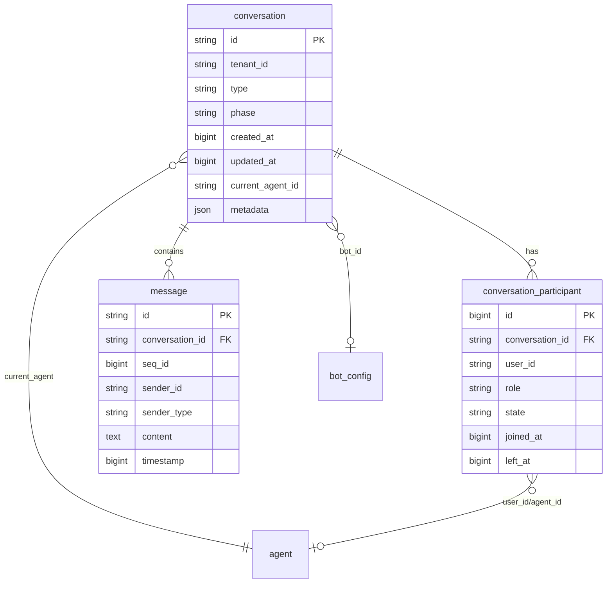

# 多人对话与客服 IM 架构设计（P7 水平·详细版）

本文从**数据库实体、会话流转与历史合并、多对多参与关系、流式展示防错乱、高并发与高可用、大模型会话归属与上下文、前端崩溃监控与上报**等维度，给出可落地的设计方案、取舍理由、边界条件与实现要点，达到 P7 方案评审与跨团队对齐的深度。

---

## 1. 数据库实体是什么，会话存哪些实体

### 1.1 领域模型与实体边界

- **会话（Conversation）**：一次「对话」的完整生命周期，是消息、参与人、阶段流转的聚合根。不按「Bot 会话」「人工会话」拆成两个会话，而是**一个会话多阶段**（phase 流转），避免消息 id、历史合并的复杂度。
- **参与人（Participant）**：谁在会话里、以什么角色、从何时到何时。独立成表是为了：审计（谁参与过）、转接（原坐席离开、新坐席加入）、多坐席协作（如主管旁听）、查询「某人的所有会话」。
- **消息（Message）**：会话内的一条条内容，强归属 conversation_id，会话内顺序用 seq_id 保证。
- **坐席 / Bot 配置**：与「人」或「机器人」相关的元数据，参与人表通过 user_id / agent_id 关联，不把会话级状态（如当前负责的 agent）只放在 conversation 单列，而是以 participant 为权威，conversation 可冗余便于列表查询。

### 1.2 核心实体与字段说明（含设计理由）

| 实体 | 核心字段 | 设计理由与约束 |
|------|----------|----------------|
| **conversation** | id(PK), tenant_id, type, phase, created_at, updated_at, metadata(JSON) | id 全局唯一（如 UUID 或 snowflake）；tenant_id 多租户隔离与分表；type 区分 bot/agent/group 等；phase 表示 bot→queuing→agent→closed，驱动路由与权限；metadata 存扩展（如渠道、来源页、标签）。 |
| **conversation_participant** | id(PK), conversation_id(FK), user_id, role, joined_at, left_at, state, metadata | 唯一约束 (conversation_id, user_id) 或 (conversation_id, user_id, joined_at) 若允许多次进出；left_at 为空表示仍在会话中；state 可选 active/transferred/inactive，便于转接与统计。 |
| **message** | id(PK), conversation_id(FK), seq_id, sender_id, sender_type, content, type, status, timestamp, metadata(JSON) | id 全局唯一，**永不改变**；seq_id 会话内单调递增，用于排序与增量同步（sync after seq_id）；sender_type 固定枚举 user/bot/agent/system，前端展示与风控依赖。 |
| **agent** | id, tenant_id, name, status, max_concurrent, updated_at | 坐席维表；status 在线/忙碌/离线，用于路由与排队。 |
| **bot_config** | id, tenant_id, model_id, system_prompt, params(JSON) | 按租户或会话绑定，params 可含 temperature、max_tokens 等。 |

### 1.3 索引与查询模式

- **conversation**：`(tenant_id, updated_at DESC)` 做会话列表；`(tenant_id, phase)` 做待接入队列；`(id)` 主键。
- **conversation_participant**：`(conversation_id)` 查某会话所有参与人；`(user_id, left_at)` 查某人当前/历史会话（left_at IS NULL 为当前）。
- **message**：`(conversation_id, seq_id)` 做会话内分页与 sync；`(conversation_id, timestamp)` 若按时间查；消息 id 全局唯一，可单独唯一索引。

### 1.4 冗余与一致性

- **conversation.current_agent_id**：冗余「当前负责客服」，写入时由 participant 表推导（role=agent 且 left_at IS NULL 的那条），用于列表与路由；以 participant 为权威，冗余不一致时以 participant 为准修复。
- **conversation.last_message_at / last_message_preview**：列表展示用，可异步更新或通过消息写入时同步更新，需权衡一致性要求与写入放大。

### 1.5 分库分表与多租户

- **多租户**：所有表带 tenant_id；按 tenant_id 做逻辑隔离，必要时按 tenant_id hash 分库。
- **message 分表**：按 conversation_id 取模或按时间（如按月）分表，控制单表行数与热键；同一 conversation 的消息落在同一张表，保证会话内查询不跨表。
- **conversation 分表**：按 tenant_id + id 范围或时间分表；participant 随 conversation 分表或按 conversation_id 路由。

### 1.6 软删除与审计

- 消息一般不物理删，用 **status=recalled** 或 **deleted_at** 表示撤回/删除，审计与合规可查历史。
- 会话可 **closed_at** 表示结束，participant 的 left_at 表示离开时间，便于「谁在何时参与」的审计。

### 1.7 实体关系示意（ER）



### 1.8 metadata 示例与扩展字段

- **conversation.metadata**：`{ "channel": "web", "sourceUrl": "...", "tags": ["vip"], "extra": {} }`，便于按渠道/标签统计与路由。
- **message.metadata**：`{ "quote": { "messageId", "content" }, "readBy": [...], "reactions": [...], "recalled": true }`，与业务功能（引用、已读、表情、撤回）对齐；新增能力尽量放 metadata，避免频繁改表。
- **容量参考**：单表 message 控制在千万级内可接受；超量则必须分表，同一 conversation 的消息必须落在同一分片（按 conversation_id 取模或 hash）。

### 1.9 常见坑与避坑

- **只存 current_agent_id 不存 participant**：转接历史与审计无法还原，必须保留 participant 表。
- **message 表存 conversation 的 phase**：phase 会变，消息应只存当时快照（若有合规需求可存 metadata.phase_at_send），常规展示用当前 conversation.phase 即可。
- **分表后 conversation 与 message 不在同一库**：会话与消息的 JOIN 会跨库，应避免；会话维表与消息表按同一分片键（如 tenant_id + conversation_id）路由到同库或同实例。

---

## 2. 流转的话，消息 id 要变吗，怎么存可以看到历史消息，怎么合并

### 2.1 消息 id 与 seq_id 的设计原则

- **message.id（业务主键）**：全局唯一、创建后**永不改变**、不随转人工/转 Bot/合并会话而改写。理由：
  - 前端去重、引用回复、撤回、已读回执都依赖唯一 id；
  - 审计与排查可唯一定位一条消息；
  - 避免「同一条消息在多个会话或多次展示中 id 不同」的歧义与重复。
- **seq_id**：会话内单调递增，由服务端在写入时分配（DB 自增或 Redis INCR conversation:{id}:seq），用于会话内顺序与增量同步（如 sync after_seq_id）；**不因 phase 变更而重排**。

### 2.2 单会话多阶段（推荐）

- **一个 conversation 贯穿 Bot → 排队 → 人工**：所有消息的 conversation_id 相同，phase 在 conversation 上更新（如 bot → queuing → agent），消息表不写 phase，查会话时带出 phase 即可。
- **历史**：按 conversation_id 查 message，ORDER BY seq_id，即得完整时间线；无需合并多表或多会话。

### 2.3 若存在「多会话」如何合并展示

- **场景**：历史遗留或特殊业务下存在「Bot 会话」与「人工会话」两条 conversation 记录，需要一条时间线展示。
- **关联**：用 **conversation_relation** 表，例如 (conversation_id, parent_id) 或 (conversation_id, merge_into_id)，表示「这两条会话属于同一次客户旅程，展示时合并」。
- **合并算法**：
  1. 根据 relation 查出需合并的 conversation_id 列表；
  2. 分别查各会话的 message，均按 seq_id 排序；
  3. 若各会话的 seq_id 独立递增、无全局顺序，则按 **timestamp** 做多路归并；若有全局逻辑序（如 event_id），可按该序归并；
  4. 输出一条有序 message 流，**用 message.id 去重**（同一条消息只出现一次）；
  5. 前端按该顺序渲染，每条消息可带 conversation_id 或 phase 标记用于展示「来自 Bot / 来自客服」。
- **不复制消息**：合并只是「查询与排序」层逻辑，不把消息复制到另一会话、不重新分配 id。

### 2.4 幂等与重复

- 写入消息时客户端带 **client_msg_id**，服务端按 (conversation_id, client_msg_id) 做唯一约束或先查后插，重复请求返回已有 message.id，保证幂等。
- 同步/拉取历史时用 message.id 去重，避免网络重试或多端导致同一条消息展示多次。

### 2.5 消息 id 与 seq_id 生成策略

| 方案 | 适用场景 | 说明 |
|------|----------|------|
| **message.id** | 全局唯一 | UUID v4 简单无依赖；Snowflake 可排序、占位小，需机器位与序列号；业务前缀（如 msg_）便于日志与排查。 |
| **seq_id** | 会话内单调递增 | Redis `INCR conversation:{id}:seq` 高性能、易过期需兜底；DB 自增序列（如 MySQL AUTO_INCREMENT 或 SEQUENCE）可靠；同一会话的写必须串行取号或同一 worker，避免乱序。 |

### 2.6 增量同步（sync）接口设计要点

- **请求**：`GET /sync?conversation_id=xxx&after_seq_id=yyy&limit=50`，表示拉取该会话中 seq_id > yyy 的最近 50 条。
- **响应**：按 seq_id 升序返回 message 列表；若服务端有「撤回」等事件，可一并返回（如 type=message_recall, message_id=zzz），客户端按 message.id 更新本地状态。
- **去重**：客户端用 message.id 做本地去重；多端或重试可能导致同一条被拉多次，去重后只展示一次。
- **冲突**：若两端同时发消息，服务端按收到顺序分配 seq_id，不存在「覆盖」；客户端以服务端 ACK 或 sync 结果为准，覆盖本地乐观展示的 seq_id/status。

### 2.7 合并多会话时的边界

- **同一 message 不会出现在多个 conversation**：合并只是「多会话的 message 在一个视图里按时间排」，不复制行；若业务误把同一条消息写入了两个 conversation（错误设计），需在应用层按 message.id 去重。
- **timestamp 精度**：多路归并时若 timestamp 只到秒，同一秒内多条可能乱序；可 (timestamp, seq_id) 或 (timestamp, id) 作为二级排序，保证稳定序。

---

## 3. 会话和人是多对多的，如何设计

### 3.1 关系模型

- **conversation N : M user/agent**：一个会话可有多个参与者（一个用户、多个客服、Bot 等），一个客服可同时参与多个会话（多会话并发）。
- **中间表 conversation_participant**：每行表示「某人在某会话中的一段参与」，主键建议自增 id，唯一约束 (conversation_id, user_id) 若不允许同一人同会话多次进入；若允许「离开后再进入」，则唯一约束改为 (conversation_id, user_id, joined_at) 或增加 rejoin 语义。

### 3.2 角色与状态

- **role**：user(访客)、bot、agent(人工)、system、supervisor(主管) 等；用于权限与展示。
- **joined_at / left_at**：参与时段；left_at 为空表示当前仍在会话中。
- **state（可选）**：active（当前负责）、transferred（已转出）、inactive；转接时原坐席置 transferred 并写 left_at，新坐席插入新记录并 state=active。

### 3.3 转接与并发

- **转接**：原 agent 的 participant 记录写 left_at、state=transferred；新 agent 插入新 participant 记录，joined_at=now，state=active；conversation.current_agent_id 更新为新 agent_id。
- **并发**：同一会话同时有多条 agent 记录时，通过 state 或 left_at 区分「当前负责」；列表与路由只取 state=active 且 left_at IS NULL 的那条。
- **唯一约束**：若业务允许多次进入，可用 (conversation_id, user_id, joined_at) 或增加 seq 字段区分同一人同会话的多段参与。

### 3.4 查询模式

- 「某人的所有会话」：`SELECT c.* FROM conversation c JOIN conversation_participant p ON c.id = p.conversation_id WHERE p.user_id = ? [AND p.left_at IS NULL] ORDER BY c.updated_at DESC`。
- 「某会话当前参与人」：`SELECT * FROM conversation_participant WHERE conversation_id = ? AND left_at IS NULL`。
- 「当前负责的客服」：上述结果中 role=agent 且 state=active 的那条；或冗余 conversation.current_agent_id 直接查。

### 3.5 转接流程（时序）

1. 用户/系统发起转接（或分配）：选定目标 agent_id。
2. 更新原 agent 的 participant：`left_at = now(), state = 'transferred'`。
3. 插入新 participant：`conversation_id, user_id=新 agent_id, role=agent, joined_at=now(), state=active`。
4. 更新 conversation：`phase='agent', current_agent_id=新 agent_id, updated_at=now()`。
5. 可选：写一条 system 消息「会话已转接至 xxx」，便于前端展示与审计。
6. 推送：向用户端与新旧坐席推送「会话已转接」或 participant 变更事件。

### 3.6 参与人状态与边界

- **同一会话同一人多条 participant**：若允许多次进入（如离开后再接入），唯一约束不能是 (conversation_id, user_id)，可改为 (conversation_id, user_id, joined_at) 或增加 participant_seq；查询「当前参与人」时取 left_at IS NULL 的即可。
- **转接时目标坐席离线**：可先插入 participant 并 current_agent_id 指向该坐席，坐席上线后拉取「分配给我的会话」；或转接时校验 status=online 再分配，否则入队列等待。
- **主管介入（旁听）**：插入 role=supervisor 的 participant，left_at 为空；展示与权限按 role 区分，不改变 current_agent_id。

---

## 4. 流式怎么解决样式错乱的问题

### 4.1 问题根因

- **布局抖动**：流式逐 token 追加导致节点高度不断变化，引发 reflow，滚动条位置变化、输入框被顶走。
- **富文本错乱**：Markdown/HTML 流式输出时，未闭合的标签（如 `<code>`、`###`）会使后续内容被错误解析，样式错乱甚至 XSS 风险。
- **虚拟列表冲突**：若流式消息放在虚拟列表的 item 中，高度持续变化会触发 Virtuoso 大量重算，卡顿与跳动。

### 4.2 方案与实现要点

| 手段 | 实现要点 | 注意 |
|------|----------|------|
| **占位与最小高度** | 流式气泡/块设 min-height（如 2em 或 80px），或外层固定高度 + 内部滚动；避免从 0 撑开导致整页跳动 | 与设计稿平衡，避免留白过大 |
| **滚动锚定** | 流式追加前记录 scrollTop 或锚定底部元素；追加后恢复「底部贴底」或保持锚点相对视口不变（如 scrollIntoView 或 scrollTop 补偿） | 与虚拟列表的 followOutput 配合，只对「最后一条」生效 |
| **独立流式容器** | 当前正在流式输出的回复**不**放入虚拟列表的 item，而是放在列表底部单独 div（或 Virtuoso Footer）；流式结束后再将该条写入 data 并清空 Footer，由虚拟列表接管 | 避免流式过程中频繁改列表长度与每项高度 |
| **流式阶段仅纯文本** | 流式过程中只渲染纯文本或极简 inline 标签（如 `<span>`）；完整响应结束后再对整段内容做 Markdown/代码块解析并替换 DOM | 避免未闭合的 ``` 或 ### 影响后续样式 |
| **防抖与批量更新** | 每 N 个 token（如 5）或每 50–100ms 更新一次 React state，减少 setState 频率，降低 layout thrashing | N 过大会显得卡顿，过小仍会抖动，需压测 |
| **content-visibility** | 非视口内的消息项设 content-visibility: auto，减少重排范围 | 与虚拟列表通常已具备的「只渲染可见项」重叠，可择一 |
| **SSR/ hydration 与流式** | 若服务端也流式，需保证服务端输出的 HTML 片段与客户端 hydrate 后的结构一致，避免 hydration mismatch；或流式部分不做 SSR，仅客户端渲染 | 流式内容一般不 SSR，避免复杂度 |

### 4.3 推荐组合（可落地方案）

- 流式回复放在**独立容器**（列表外或 Virtuoso Footer），容器内**占位高度 + 纯文本流式**，结束后再**一次性解析富文本**并写入消息列表。
- 列表使用**虚拟列表 + 底部锚定**，新消息在底部时自动 scrollTop 跟到底部；流式仅在独立容器内进行，不触发列表项高度变化。

### 4.4 边界与性能

- **超长回复**：流式块可设 max-height + overflow auto，避免单条过高撑破布局。
- **弱网**：流式 chunk 可能延迟大，需 loading 态与超时降级（如转非流式或提示重试）。

### 4.5 实现参数建议（可调）

- **防抖**：每 3–5 个 token 或 50–80ms 更新一次 state；移动端可适当加大间隔降低 reflow。
- **占位高度**：单行约 1.5em，流式块 min-height 建议 2–3em，避免首字出现前布局为 0。
- **虚拟列表 overscan**：流式条在 Footer 时，列表 overscan 保持 5–10 即可；流式条高度固定或 min-height 后，列表重算次数会明显减少。

### 4.6 流式 Footer 与 state 示例（React）

```tsx
// 状态：已完成消息列表 + 当前流式内容
const [messages, setMessages] = useState<Message[]>([]);
const [streamingContent, setStreamingContent] = useState('');
const [streamingDone, setStreamingDone] = useState(false);

// 流式回调：每批 token 追加
const onStreamChunk = (chunk: string) => {
  setStreamingContent(prev => prev + chunk);
};

// 流式结束：写入列表、清空流式、可选解析 Markdown
const onStreamEnd = (fullContent: string) => {
  const newMsg = { id: genId(), content: fullContent, senderType: 'bot', ... };
  setMessages(prev => [...prev, newMsg]);
  setStreamingContent('');
  setStreamingDone(true);
};

// Virtuoso Footer：仅在有流式内容时渲染一块固定区域
<Virtuoso
  data={messages}
  itemContent={(i, msg) => <MessageBubble message={msg} />}
  components={{
    Footer: () => streamingContent ? (
      <div style={{ minHeight: 48 }} className="streaming-bubble">
        {streamingContent}
      </div>
    ) : null
  }}
/>
```

### 4.7 常见坑与避坑

- **流式过程中切会话**：需取消当前流式请求并清空 streamingContent，避免内容串到新会话。
- **Markdown 在流式时解析**：未闭合的 ``` 会把后续普通段落当成代码块；务必流式阶段只展示纯文本，结束后再整段解析。
- **虚拟列表总高度依赖 Footer**：Footer 有 min-height 时 Virtuoso 会计入总高度，滚动条正确；若 Footer 高度为 0 会闪一下，所以流式块至少设 min-height。

---

## 5. 多人高并发怎么解决

### 5.1 容量与目标

- 先明确 QPS、在线连接数、单会话消息量级（如峰值 10w 连接、1w 条/秒消息），再定读写分离、缓存、分库分表与连接层方案。
- 读多写多：消息列表、会话列表读多；消息写入写多；需分离读路径与写路径，写路径保证顺序与持久化。

### 5.2 读写分离与缓存

- **读**：会话列表、消息列表走**从库/只读副本**，降低主库压力；热点会话最近 N 条消息可放 **Redis**（key: conversation:{id}:messages，list 或 zset，TTL 如 5 分钟），先读缓存再回源 DB。
- **写**：消息写**主库**；若写 QPS 极高，可先写 **Redis 队列**（如 list），后台 worker 批量消费落库，需保证**至少一次**与**会话内顺序**（同一 conversation 的写由同一 worker 串行处理，或用 seq_id 在 DB 侧保证顺序）。

### 5.3 消息顺序与 seq_id

- **seq_id**：会话内单调递增，可用 Redis `INCR conversation:{id}:seq` 或 DB 自增序列；写消息时先取 seq_id 再落库，保证同一会话内顺序。
- **跨会话**：不同会话并发写互不影响；同一会话的写建议串行（单 worker 或单连接）或用分布式锁保证顺序。

### 5.4 连接层与推送（多机）

- **问题**：用户 WebSocket 连在机器 A，消息写入在机器 B，B 需把消息推到 A 上的连接。
- **方案一**：**Sticky Session**，同一用户总是连到同一台机器（如按 userId hash 或一致性哈希），写消息的服务先查「该用户连接在哪台机器」，再转发到该机器由该机器推送到对应 WebSocket。
- **方案二**：**Redis Pub/Sub 或 Kafka**；每台机器订阅「需由本机推送」的 channel（如 user:{userId}）；写消息的服务在落库后向 user:{userId} 发布「推这条消息」的指令，连接该用户的机器消费后推送到 WebSocket。
- **连接注册**：每台机器维护 userId → WebSocket 的本地 map，并把自己的地址或 channel 注册到 Redis/配置中心，便于路由。

### 5.5 限流与保护

- **按 userId**：每秒/每分钟最多 N 条，防止单用户刷屏与恶意请求。
- **按 conversation**：单会话写入频率限制，配合前端防重复提交。
- **按租户/全局**：保护 DB 与下游，超出时返回 429 或排队。

### 5.6 幂等与去重

- **写入**：客户端带 client_msg_id，服务端 (conversation_id, client_msg_id) 唯一；重复请求返回已有 message.id，不重复落库。
- **推送/拉取**：消费端用 message.id 去重，避免重试或多端导致同一条消息展示多次。

### 5.7 数据库与连接池

- **连接池**：按实例数与 DB max_connections 设置 pool size；可拆「读池」与「写池」。
- **分库分表**：message 按 conversation_id 取模或按时间分表；conversation 按 tenant_id 分表；控制单表规模，便于水平扩展。

### 5.8 可用性与观测

- **降级**：从库延迟过大时读主库或返回缓存旧数据并标记；写队列堆积时限流或拒绝非关键写。
- **监控**：写延迟、从库延迟、Redis 命中率、推送延迟、连接数；告警与容量规划。

### 5.9 容量粗算与选型

- **例**：目标 1w 条消息/秒、10w 在线连接。单机 WebSocket 约 1–2w 连接、单机写 DB 约 1–2k TPS，则需约 5–10 台 WS 机、5–10 台写服务；写服务前可加 Kafka，按 conversation_id 分区，同一会话落同一分区保证顺序；消费者多实例，每分区一消费者。
- **Redis 热点**：key `conv:{conversation_id}:msgs` 存最近 50–100 条（list 或 zset），TTL 5min；读时先 LRANGE 再按需回源 DB；写时先落 DB 再 DEL 或 RPUSH 更新缓存，避免读穿透。
- **连接注册**：Redis Hash `ws:conn:{userId}` → `{ "node": "ws-node-1", "connId": "..." }`，TTL 略大于心跳间隔（如 90s）；写消息的服务根据 userId 查 node，再通过 RPC 或 Redis Pub/Sub 把推送任务发到该 node。

### 5.10 Redis / Kafka 键与分区

- **seq_id**：`INCR conv:{conversation_id}:seq`，若 key 不存在可设 NX + 从 DB 拉取当前 max(seq_id)+1 初始化；过期时间可设 7 天，冷会话从 DB 重建。
- **Kafka**：topic `message-write`，partition key = conversation_id，保证同一会话消息顺序；consumer 组内每个 partition 一个 consumer，写 DB 后发推送事件到另一 topic 或直接调 WS 网关。
- **限流**：Redis `INCR rate:user:{userId}:{window}`，window 按秒或分钟，EXPIRE 设窗口长度；超过 N 返回 429。

### 5.11 常见坑与避坑

- **写放大**：每条消息写 DB 再更新 conversation.updated_at、last_message_preview 会放大写；可异步更新 last_* 或只更新 updated_at，preview 用最近一条消息内容在读时拼。
- **从库延迟**：刚发的消息在从库查不到，列表会缺一条；可写后短期（如 1s）内读主库，或推送已带完整消息，前端以推送为准不依赖立即 sync。
- **WS 与 HTTP 分离部署**：WS 长连在一组机器，HTTP 在另一组；写消息的 HTTP 服务不直接持连接，必须通过 Redis/Kafka 把推送任务交给 WS 机器。

---

## 6. 大模型没有记忆，怎么知道是谁回复的

### 6.1 问题本质

- 大模型 API 无「身份」概念；多角色（多 Bot、多客服、Bot+人工）时，必须由**业务层**在每条回复上标明 sender，否则前端无法展示「谁说的」。

### 6.2 谁回复：写入时确定 sender

- **message 表**：每条消息必有 sender_id、sender_type（user/bot/agent/system）；可选 sender_name、sender_avatar、metadata.agent_id、metadata.bot_id。
- **流式与非流式一致**：在**发起本次回复请求时**就确定「这条回复的 sender」——例如当前 conversation.phase=agent 则 sender=current_agent_id、sender_type=agent；phase=bot 则 sender=bot_id、sender_type=bot。流式 chunk 落库或首次推送时即带上该 sender，前端自始至终用同一套 sender 展示。

### 6.3 多 Bot / 多 Agent

- **当前负责**：conversation 或 participant 表维护 current_agent_id、current_bot_id（或由 participant 中 state=active 的记录推导）。
- **转人工**：更新 current_agent_id，之后所有人工回复用该 agent 的 sender_id；Bot 回复用 bot_id。
- **多 Bot 场景**：按路由规则（如技能组、标签）选一个 bot_id，该轮回复的 sender 即该 bot。

### 6.4 「记忆」：用历史消息做上下文

- 大模型无跨请求记忆，**记忆由业务维护**：按 conversation_id 拉取历史 message（或摘要），在调用大模型时拼进 prompt（如 system + 历史若干轮 + 当前用户输入）。
- **上下文窗口**：控制历史条数或 token 数，超出则截断或摘要；可保留最近 N 条 + 关键摘要。
- **归属清晰**：历史消息里每条都有 sender_id/sender_type，拼 prompt 时可带「用户：」「Bot：」「客服张三：」等前缀，便于模型理解对话结构；写入新回复时仍按当前 phase 写 sender。

### 6.5 小结

- **谁回复**：由当前会话 phase + current_agent_id / bot_id 在**请求时**确定，写入 message 的 sender 字段，流式与非流式一致。
- **模型记忆**：用 conversation 维度历史 message 做上下文注入，不依赖模型内存；多角色时历史中每条都有明确 sender，新回复的 sender 由业务规则决定。

### 6.6 上下文拼装与窗口控制

- **Prompt 结构示例**（文本型）：
  ```
  [System] 你是客服助手，当前会话已转人工，客服为张三。
  历史对话：
  用户：你好
  Bot：您好，请问有什么可以帮您？
  用户：转人工
  System：会话已转接至客服张三。
  客服张三：您好，我是张三，请问有什么可以帮您？
  用户：{当前输入}
  ```
- **截断策略**：按 token 数上限（如 4k/8k）截断；优先保留最近 N 轮（每轮 user + assistant），再保留更早的摘要或丢弃；可对更早消息做 summarization 再注入。
- **归属前缀**：每条历史消息带「用户：」「Bot：」「客服 xxx：」再拼进 prompt，模型才能区分角色；新回复写入 DB 时 sender 与当前 phase/current_agent 一致。

### 6.7 多 Bot / 多 Agent 时的 sender 决策（伪代码）

```ts
function resolveSender(conversation: Conversation): { senderId: string; senderType: string } {
  if (conversation.phase === 'agent' && conversation.current_agent_id) {
    return { senderId: conversation.current_agent_id, senderType: 'agent' };
  }
  if (conversation.phase === 'bot') {
    const botId = conversation.current_bot_id || defaultBotId;
    return { senderId: botId, senderType: 'bot' };
  }
  return { senderId: 'system', senderType: 'system' };
}
// 每次生成回复前调用，结果写入 message.sender_id / sender_type
```

### 6.8 常见坑与避坑

- **流式首包未带 sender**：前端会先展示「无头像」再变成有头像，体验差；首包就必须带 sender，与后续一致。
- **历史顺序错乱**：拼 prompt 时必须按 seq_id 或 timestamp 排序，否则模型会混淆对话顺序。
- **多租户 Bot 混用**：不同租户的 system_prompt 与 bot_id 要隔离，resolveSender 用的 defaultBotId 应按 tenant 或 conversation 取。

---

## 7. 上报如果页面崩溃了怎么监控

### 7.1 崩溃与「离开」的区分

- **正常离开**：用户关标签页、导航走，会触发 beforeunload/unload（不一定 100% 触发），可做一次上报（如 sendBeacon）。
- **崩溃/强杀**：进程被杀、白屏、Tab 崩溃，通常**不会**触发 unload，只能通过「心跳中断 + 下次进入」推断。

### 7.2 检测与上报手段（详细）

| 手段 | 实现要点 | 局限 |
|------|----------|------|
| **beforeunload / unload** | 在 unload 里 sendBeacon 上报「离开」；可带 session_id、url、停留时长 | 真崩溃时往往不触发；部分浏览器在 unload 中限制异步请求，sendBeacon 更可靠 |
| **visibilitychange** | 页面从可见变为隐藏时 sendBeacon 一次（如「用户切走」），可作最后一次有效上报 | 无法区分「切走」与「崩溃」 |
| **心跳 + 下次 load 推断** | 前端定时（如 15s）把 last_heartbeat 写 localStorage 或发往后端/SW；下次页面 load 时读上次心跳时间，若超过阈值（如 2 分钟）且非用户主动关闭（如无 beforeunload 标记），则上报「疑似崩溃」 | 有误报（用户长时间不操作、休眠）；可结合「是否有 beforeunload」降低误报 |
| **Service Worker** | SW 与页面进程分离；页面向 SW 发心跳，SW 超时未收到则上报「可能崩溃」 | SW 本身也可能被回收；实现与调试成本较高 |
| **Error boundary** | React 的 componentDidCatch 中立即 sendBeacon（或同步 XHR）上报错误与堆栈；可配合 source map 还原行号 | 只能捕获渲染阶段错误，无法捕获运行时未 catch 的异常或原生崩溃 |
| **window.onerror / unhandledrejection** | 全局捕获未处理错误与 Promise 拒绝，在回调里 sendBeacon；崩溃前最后一刻的错误有机会被捕获 | 跨域脚本可能只有 "Script error"；部分错误不会冒泡 |
| **sendBeacon** | navigator.sendBeacon(url, payload) 在页面卸载时仍会尝试发送，适合「最后一条」日志 | 不保证送达；payload 通常为字符串或 FormData |

### 7.3 推荐组合（可落地）

- **常规错误**：Error boundary + window.onerror + unhandledrejection，捕获即 sendBeacon 到 /api/monitor/log，带上 type、message、stack、session_id、url、user_agent。
- **崩溃推断**：每 15s 写 localStorage last_heartbeat = Date.now()；页面 load 时若 last_heartbeat 距当前 > 2 分钟且无「正常离开」标记（如 sessionStorage 里 unload_fired），则上报「疑似崩溃」，带 last_heartbeat、session_id；在 beforeunload 里设 unload_fired，用于排除正常关闭。
- **会话恢复**：重要状态（草稿、conversation_id）持久化到 localStorage/IndexedDB，崩溃恢复后可提示「是否恢复未发送内容」并上报「从崩溃恢复」类事件。

### 7.4 后端与日志

- **接口**：POST /api/monitor/log 或 /api/crash，接收 JSON（type=crash|error|leave、message、stack、session_id、url、last_heartbeat、user_agent 等），写入日志系统或时序库。
- **脱敏**：stack、message 可能含 PII 或代码，需脱敏与访问控制。
- **告警**：按 type=crash 或 error 聚合，超过阈值告警；可接 Sentry、自建日志平台等。

### 7.5 Source Map 与采样

- **Source Map**：生产环境上传 source map 到监控端，上报的 stack 可还原为源码行号；注意不要将 source map 暴露给前端。
- **采样**：高流量时可按 session_id 或随机采样上报，控制成本与噪音。

### 7.6 心跳 + 崩溃推断实现要点（前端）

```ts
const HEARTBEAT_INTERVAL = 15 * 1000;
const CRASH_THRESHOLD = 2 * 60 * 1000;
const STORAGE_KEY = 'last_heartbeat';
const UNLOAD_KEY = 'unload_fired';

// 定时写心跳
useEffect(() => {
  const tick = () => {
    localStorage.setItem(STORAGE_KEY, String(Date.now()));
  };
  tick();
  const id = setInterval(tick, HEARTBEAT_INTERVAL);
  return () => clearInterval(id);
}, []);

// 正常离开时打标
useEffect(() => {
  const onUnload = () => sessionStorage.setItem(UNLOAD_KEY, '1');
  window.addEventListener('beforeunload', onUnload);
  return () => window.removeEventListener('beforeunload', onUnload);
}, []);

// 页面 load 时判断是否疑似崩溃
useEffect(() => {
  const last = localStorage.getItem(STORAGE_KEY);
  const unloadFired = sessionStorage.getItem(UNLOAD_KEY);
  if (last && !unloadFired) {
    const elapsed = Date.now() - Number(last);
    if (elapsed > CRASH_THRESHOLD) {
      sendBeacon('/api/monitor/log', JSON.stringify({
        type: 'suspected_crash',
        last_heartbeat: Number(last),
        elapsed,
        session_id: getSessionId(),
        url: location.href,
      }));
    }
  }
  sessionStorage.removeItem(UNLOAD_KEY);
}, []);
```

### 7.7 上报 payload 与后端日志结构

- **前端 sendBeacon 示例**：`{ type: 'error'|'suspected_crash'|'leave', message, stack, session_id, url, user_agent, last_heartbeat?, elapsed? }`；Blob 或 FormData 均可，后端按 JSON 解析。
- **后端**：写入日志系统时建议带 timestamp、env、version、tenant_id（若有）；stack 脱敏（去路径、去 token）；按 type 建索引，便于查 crash 与聚合。
- **告警**：type=suspected_crash 或 type=error 且 message 含关键词时告警；按 UV 或 session 去重后算崩溃率（疑似崩溃数 / 活跃 session 数）。

### 7.8 常见坑与避坑

- **unload 不可靠**：移动端或强杀时可能不触发，所以崩溃只能依赖「心跳中断 + 下次进入」推断，会有误报（用户长时间不操作）和漏报（用户再也没回来）。
- **sendBeacon 限制**：部分浏览器 payload 大小有限（如 64KB），stack 过长需截断或压缩；sendBeacon 不保证送达，关键错误可再补一次 fetch keepalive（若支持）。
- **PII**：stack、message 可能含用户输入或 token，上报前需脱敏或过滤，符合隐私与安全要求。

---

## 附录 A：表结构示例（含索引与约束）

```sql
-- 会话
CREATE TABLE conversation (
  id VARCHAR(64) PRIMARY KEY,
  tenant_id VARCHAR(32) NOT NULL,
  type VARCHAR(16) NOT NULL,
  phase VARCHAR(16) NOT NULL,
  created_at BIGINT NOT NULL,
  updated_at BIGINT NOT NULL,
  current_agent_id VARCHAR(64),
  metadata JSON,
  KEY idx_tenant_updated (tenant_id, updated_at DESC),
  KEY idx_tenant_phase (tenant_id, phase)
);

-- 会话参与人
CREATE TABLE conversation_participant (
  id BIGINT AUTO_INCREMENT PRIMARY KEY,
  conversation_id VARCHAR(64) NOT NULL,
  user_id VARCHAR(64) NOT NULL,
  role VARCHAR(16) NOT NULL,
  state VARCHAR(16) DEFAULT 'active',
  joined_at BIGINT NOT NULL,
  left_at BIGINT,
  metadata JSON,
  UNIQUE KEY uk_conv_user (conversation_id, user_id),
  KEY idx_user_left (user_id, left_at)
);

-- 消息（按 conversation_id 取模或按时间分表时，表名加后缀）
CREATE TABLE message (
  id VARCHAR(64) PRIMARY KEY,
  conversation_id VARCHAR(64) NOT NULL,
  seq_id BIGINT NOT NULL,
  sender_id VARCHAR(64) NOT NULL,
  sender_type VARCHAR(16) NOT NULL,
  content TEXT,
  type VARCHAR(16),
  status VARCHAR(16),
  timestamp BIGINT NOT NULL,
  metadata JSON,
  KEY idx_conv_seq (conversation_id, seq_id),
  KEY idx_conv_ts (conversation_id, timestamp)
);

-- 幂等：客户端重试时用（若 client_msg_id 存 message 表）
-- ALTER TABLE message ADD COLUMN client_msg_id VARCHAR(64);
-- UNIQUE KEY uk_conv_client_msg (conversation_id, client_msg_id);

-- 多会话合并用：关联需合并展示的会话
CREATE TABLE conversation_relation (
  id BIGINT AUTO_INCREMENT PRIMARY KEY,
  conversation_id VARCHAR(64) NOT NULL,
  related_conversation_id VARCHAR(64) NOT NULL,
  relation_type VARCHAR(16) DEFAULT 'merge_display',
  created_at BIGINT NOT NULL,
  UNIQUE KEY uk_conv_related (conversation_id, related_conversation_id)
);
```

---

## 附录 B：合并多会话消息的伪代码

```
function getMergedMessages(conversationIds: string[]): Message[] {
  const streams = conversationIds.map(id => 
    db.query("SELECT * FROM message WHERE conversation_id = ? ORDER BY seq_id", [id])
  );
  const seen = new Set<string>();
  const result: Message[] = [];
  // 多路归并：按 timestamp（或全局 event_id）排序
  const heap = new MinHeap((a, b) => a.timestamp - b.timestamp);
  for (const stream of streams) {
    const first = stream.next();
    if (first) heap.push({ ...first, stream });
  }
  while (heap.size() > 0) {
    const { stream, ...msg } = heap.pop();
    if (seen.has(msg.id)) continue;
    seen.add(msg.id);
    result.push(msg);
    const next = stream.next();
    if (next) heap.push({ ...next, stream });
  }
  return result;
}

// 注意：若按 timestamp 排序，同一毫秒内多条需二级排序，例如 (timestamp, seq_id) 或 (timestamp, id)
// 否则多路归并时同一时刻来自不同会话的消息顺序不稳定。
```

---

## 附录 C：流式独立容器与列表配合（React 思路）

- 消息列表 data 为 `messages`（已完成的消息）；当前流式内容不放入 `messages`。
- Virtuoso 的 `itemContent` 只渲染 `messages` 中的项；底部用 `Footer` 渲染「当前流式块」：占位 min-height，内容为纯文本 state（流式过程中）或 null（结束后）。
- 流式结束时：将完整内容 push 进 `messages`，清空流式 state，由 Virtuoso 接管新项；此时可对刚 push 的那条做 Markdown 解析并渲染富文本。

---

## 附录 D：方案自检清单（评审用）

- **实体与表**：conversation / participant / message 边界清晰；participant 为参与权威、conversation 冗余 current_agent_id；索引覆盖列表、sync、按人查会话；分表键与同一会话落同分片一致。
- **流转与历史**：message.id 永不改；单会话多阶段优先；多会话合并仅查询层归并、不复制消息；幂等 client_msg_id；sync 接口 after_seq_id + message.id 去重。
- **多对多**：participant 表 + role/state/joined_at/left_at；转接写原记录 left_at + 新记录插入 + conversation 更新；当前负责由 state=active 且 left_at IS NULL 推导。
- **流式**：独立容器（Footer）+ 占位高度 + 流式阶段纯文本、结束后再富文本；防抖 50–80ms 或 3–5 token；切会话取消请求并清空流式 state。
- **高并发**：读写分离 + 热点缓存；seq_id 单会话串行或 Redis INCR；多机推送用 Sticky 或 Redis Pub/Sub；限流 + 幂等 + 连接注册；监控与降级。
- **大模型**：每条 message 带 sender_id/sender_type；回复前 resolveSender(phase, current_agent_id, bot_id)；历史按 seq_id 排序拼 prompt，带角色前缀；上下文截断与 token 上限。
- **崩溃监控**：Error boundary + onerror + unhandledrejection + sendBeacon；心跳写 localStorage + load 时判断 last_heartbeat 与 unload 标记；上报脱敏与采样。

---

## 文档索引（按主题速查）

| 主题 | 章节 |
|------|------|
| 会话 / 消息 / 参与人表设计、索引、分表、冗余、审计 | §1 |
| 消息 id 不变、单会话多阶段、多会话合并、sync、幂等 | §2 |
| 多对多、转接流程、参与人状态、主管旁听 | §3 |
| 流式布局/富文本/虚拟列表、参数、React 示例、坑 | §4 |
| 读写分离、缓存、seq_id、多机推送、限流、容量与 Redis/Kafka | §5 |
| 谁回复、上下文拼装、窗口截断、resolveSender、坑 | §6 |
| 崩溃推断、心跳与 unload、上报 payload、后端与采样 | §7 |
| 建表 SQL、conversation_relation | 附录 A |
| 多路归并伪代码 | 附录 B |
| 流式 Footer 与 state | 附录 C |
| 方案自检清单 | 附录 D |

---

以上 7 节 + 4 个附录覆盖**实体与表设计、流转与历史合并、多对多与转接、流式防错乱、高并发与高可用、大模型归属与上下文、崩溃监控**，并给出 ER、索引、合并伪代码、流式代码示例、心跳崩溃推断代码、Redis/Kafka 键设计、自检清单与文档索引，可直接用于方案评审与实现细化。
